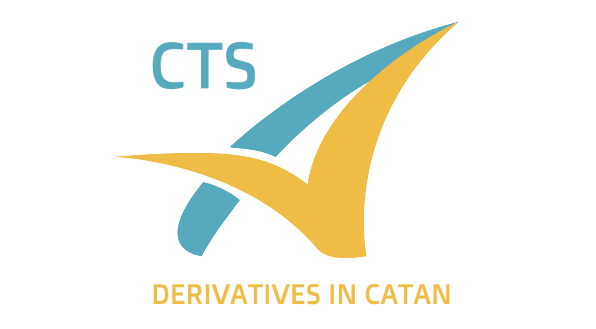

# Project Catan


This project aims to promote an online room trading platform for the Catan Table games. Originally, within the game, the only trading mode is face-to-face instant trades. This platform tries to integrate more refined financial trading deals, such as Futures and Options, among the five resources: Lumber, Wool, Grain, Brick, Ore.

First of all, this documnet will domenstrate how the website functions and the main usage of the platform. Also, this document describes the REST API implementations within the backend using Java __Spring Boot__ and H2 Database and provide the REST API for frontend development using __React.js__. 

To be noticed, the folder Project-Catan-API-Test-Collection contains the Postman collections file for the backend APIs; The folder Project-Catan-REST-API-Documentation provides an easy access to API documentations from the backend.

Interested in joining this project? Email me at muyansamxie@gmail.com

## How does the Platform Work?
Each player will first register. On the table of Catan a turn clock should be used to record the progress of turns of the game. We would use turn number as the Futures/Options execution date index and thus keeping track of current turn number is important.

Next, within the platform, players are provided with an interface to post their __Abundance__, which is basically the items they are willing to sell/trade. The player could create or delete their Abundance at any time. Also, a real time interface is provided to show all the Abundances of all the players to give all the players a sense of distribution of resources on the table. A REST API is designed to fulfill the get, create and delete operation of the database for Abundance.

At this point, as most players would have understood the rough abundance of recourses and willingness to trade of each player, they could initiate a __Futures__ or a __Options__ contract with the other player verbally.

__Futures Contract__: Each contract consists of 9 elements: Contract ID, Initiator, Acceptor, Items from Initiator, Items from Acceptor, #Turn the Contract will be executed, Collateral from the Initiator, Collateral from the Acceptor, and Status of the Contract. Examples of Futures trade will be provided in the next section.

__Options Contract__:

__Contract Exchange and Update__:
To perform contract exchange, the initiator of the contract will first post the contract to the platform. The platform will then check if the contract is valid. If the contract is valid, the contract request would be sent to the intended aceptor. The aceptor would then have the option to accept or reject the contract. If the contract is accepted, the contract would be updated to the database and the initiator and aceptor would be notified. If the contract is rejected, the contract would be deleted from the database and the initiator and aceptor would be notified.

To sell a contract, the initiator will need to post another contract that acts like a counter of the previous contract. If the proposal is accepted, the seller would be able to reach a balance and thus need not to pay the original amount.

Finally, an ADMIN panel is provided to the platform to check the status of all the contracts and to update the status of the contracts. The ADMIN panel is only accessible to the ADMIN user. The ADMIN user is the one who is responsible for the platform and is the only one who can create the ADMIN user. The ADMIN user is also the only one who can delete the ADMIN user. The ADMIN user is also the only one who can delete the contracts. The ADMIN user is also the only one who can delete the users. The ADMIN user is also the only one who can delete the Abundances.

Based on timed results, Catan Board Game with the financial complexs implemented would have the play time shortened from up to 90 min to a bare 50 min on average with the help of this platform in tracking futures and options trade.

## Installing the platform:
Make sure you have Maven and NPM installed on your local computer. Before running the following command:

```
git clone https://github.com/MuyanXie/ProjectCatan.git
cd Project-Catan-Backend
mvn clean spring-boot:run # launching the backend
cd ..
cd Project-Catan-Frontend
npm start # launching the frontend
```

Opening your brower, you will be able to see the home page at http://localhost:3000/

## Using the Website:
Click participate, you will be promoted to the register page. You can register a new user or sign in with an existing user. After signing in, you will be able to see the home page of the platform:
<p>
  
</p>
(Or you can sign in to the system use existing username and passwords)
<p>
   
</p>

After signing into your own account, you will be able to see the home page of the platform; You will see a page with all the players displayed:

__Picture Placeholder__

 <ins>Abundances</ins>

## REST API Documentation:
A Maven repository dependency *Open Api Documentation* has been embeded into pom.xml file in the Spring Boot Backend. You can access the api documentation file easily at http://localhost:8080/swagger-ui/index.html after launching the backend in local environment.

Also, you can download the __Swagger UI.html__ and __Swagger UI_files__ folder from Project-Catan-REST-API-Documentation to load a html view of REST API Documentation.

Troubleshooting Update (2023.1.26): Make sure to enable CROS access of Swagger UI.html to Swagger UI_files in your brower to render the correct content in the opened html webpage.

## Additional Information:

This project is implemented by Muyan(Sam) Xie, with all rights reserved.

Interested in implementing more features? Email me at muyansamxie@gmail.com


